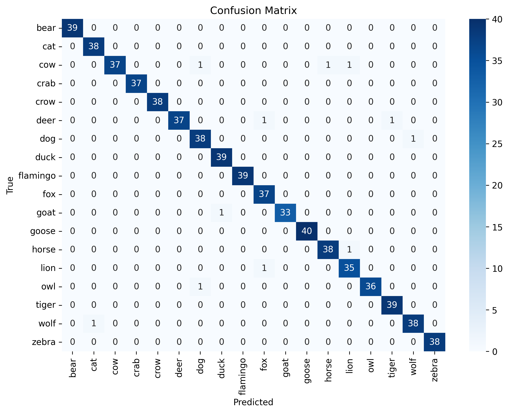

# Named entity recognition + image classification

This repository contains a pipeline that integrates two models: one for Named Entity Recognition (NER) and another for image classification. The goal is to validate if a user’s text description of an image (containing an animal) is correct or not.

## Task Description

- **NER Model**: Extracts animal titles from text input.
- **Image Classification Model**: Classifying animals in images.
- **Pipeline**: Takes as inputs a text message and an image, and outputs a boolean value indicating whether the text correctly describes the animal in the picture.

## Datasets
The datasets for both NER and image classification are available in the following [Google Drive folder](https://drive.google.com/drive/folders/1aifEZPkfM_9oWubFLyK7S0AzjBXF1mUG?usp=drive_link).
A more detailed description of the datasets can be found in the [Notebook]([https://colab.research.google.com/drive/17jakO__iZXqMzsHbciOTl_xjChaRr-eG?usp=sharing](https://github.com/Silence-o0/Test-tasks/blob/main/Task2/notebook.ipynb)).


## Models

### Named Entity Recognition (NER)
- **Model**: Transformer-based. Distilbert-base-uncased
- **Hyperparameters**:
  - 10 epochs
  - batch_size=16
  - learning_rate=2e-5
  - weight_decay=0.01
- **Test Dataset Evaluation**:
  - eval_loss: 0.04752221703529358
  - eval_precision: 1.0
  - eval_recall: 0.9523809523809523
  - eval_f1: 0.975609756097561
  - eval_accuracy: 0.9963369963369964
  - eval_runtime: 0.553
  - eval_samples_per_second: 37.971
  - eval_steps_per_second: 3.616

### Image Classification (CV)
- **Model**: AlexNet
- **Hyperparameters**:
  - 8 epochs
  - batch_size=16
  - learning_rate=1e-4
- **Accuracy on test dataset**: 98.40%
  
  Confusion matrix:
  

## How to Run

1. Clone the repository:

   ```bash
   git clone https://github.com/Silence-o0/Test-tasks
   cd Test-tasks/Task2
   ```

2. Install the required dependencies:

   ```bash
   pip install -r requirements.txt
   ```

3. Install datasets from [Google Drive folder](https://drive.google.com/drive/folders/1aifEZPkfM_9oWubFLyK7S0AzjBXF1mUG?usp=drive_link). You should unzip each folder in ./Tesk-tasks/Task2/[folder_name]. Please, make sure that the folder name matches the corresponding archive.

   Optional: If you want to skip the training steps and go ahead to run the pipeline, you can download the prepared models. You can find them in the 'Models' folder in the Google Drive directory above.
Place the file 'cv_model.pth' in the directory ./Test-tasks/Task2.
Unzip the 'ner_model' archive into ./Test-tasks/Task2/ner_model.
   

5. Train the NER Model:
   
   To train the NER model, use the following script:

   ```bash
   python ner_train.py
   ```

6. Train the Image Classification Model:

   To train the image classification model, use:

   ```bash
   python cv_train.py
   ```

7. Running the Pipeline:

   To test the pipeline with a text and an image, run the following:

   ```bash
   python pipeline.py "text" "path_to_image"
   ```

   The pipeline will output 'True' if the animal in the image matches the text description, or 'False' otherwise.


